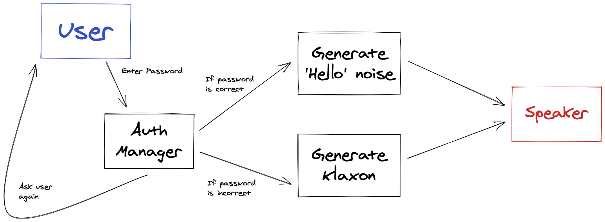
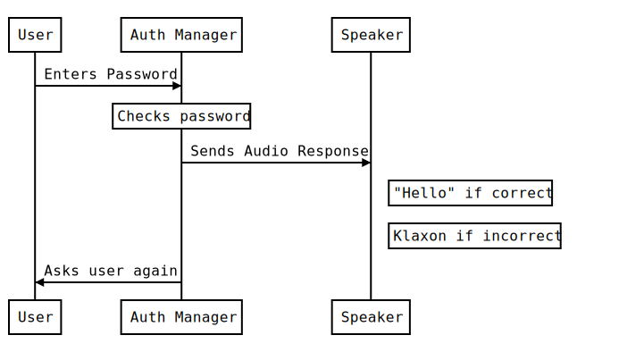

# Maintenance module

Every time I have spoken to engineers about COBOL, they have told me that COBOL
itself is far from the biggest challenge. The real challenge is working with
legacy or mature codebases. These tend to be large, complex, and unfamiliar.

This module you will learn and put into practice some techniques for working with
mature software projects. The projects you will encounter in work will very
likely be even larger than these.

## Learning objectives

* Learn that while mature software projects may seem intimidating at first, you
  can still understand and modify them with due care and effort.
* Learn to apply tests to control changes to mature software.
* Learn to trace execution through a complex system.
* Learn to diagram out a complex system to identify opportunities for change.

## Project 1: Gilded Rose

The Gilded Rose is a well-known exercise in working with legacy code. You are
given a small but very messy codebase, and asked to make a small change to it.
If you just immediately try to implement the change, it is challenging.

You can view one of the key qualities of software as 'how easy is it to change?'
This code is hard to change.

The learning objective here is to:

* Learn to apply tests to control changes to mature software.

[Take a look at the exercise](./gilded_rose)

### Applying Tests

If you want to change some legacy code, you will almost always have to go
through a process of discovery and verification a bit like this:

1. Identify the current behaviour of the code.
2. Change that behaviour.
3. Verify that the new behaviour works as expected.
4. Verify that the prior behaviour still works as expected.

To put it in simple terms, if you're going to change some code you need to make
sure you don't break things in the process! And to do this, you need to some
form of testing.

That might be manual testing. However, it is usually both more efficient and
more reliable to introduce automated testing. Plus, you will be helping your
colleagues later on.

In this codebase you have a starter to help you. Very often in your career you
won't have this, and you'll have to create your own testing infrastructure!
That's where it gets really exciting, but we'll come to this in a future
project.

## Project 2: 2048

This code is a COBOL implementation of the popular game 2048 drawn from the
GnuCOBOL example software. [You can play a web-based version here](https://play2048.co/). Your task is to make some changes to this program.

This is a large program, and you will benefit from another another maintenance
technique.

The learning objective here is to:

* Learn to apply diagramming to navigate and change existing software.

[Take a look at the exercise](./2048)

### Diagramming

There are many ways to diagram. These can be broken down into two kinds

1. Formal Diagrams. These conform to a standard, using particular shapes,
   symbols, and colours to mean specific things. One example is UML. These are
   particularly useful for long-lived documentation since their formal nature
   allows them to be interpreted decades later.
2. Informal Diagrams. These are invented by the diagrammer based on the things
   he or she knows and wants to communicate at the time. These are particularly
   useful for immediate communication by a team since they can be aided by a
   conversation.

In this exercise, we will focus on informal diagrams. Formal diagrams are very
useful, but take some time and practice to learn.

You can use either paper or an app. As of 2021, [Concepts](https://concepts.app/en/)
and [Paper](https://paper.bywetransfer.com/) are good tablet apps for diagramming.
[Excalidraw](https://excalidraw.com) and [Diagrams.net](https://www.diagrams.net)
are good collaborative web based tools. Find something that feels comfortable
for you and your collaborators.

Here are two forms of diagram you will find useful:

#### Box and Arrow Diagrams

In this form of diagram, you draw out some entities (boxes) and the
relationships (arrows) between them. It's important to be clear in your
labelling, particularly of the arrows. This form of diagram is very flexible
and can handle quite a lot of detail, but does not easily represent sequence.

#### Sequence Diagrams

In this form of diagram, you identify the sequence of actions by and between
the entities you are modelling. It is very useful for diagramming out scenarios
between interacting parts of a program in a clear way, but less good at handling
a lot of information or representing branching logic.

## Project 3: DWP

This code is COBOL code received directly from DWP, along with associated
documentation. Your task is to analyse this code to understand as much about
it as possible. This will be a difficult challenge.

Your coach will share a link to this exercise in a workshop.
# cobol-maintenance-module
